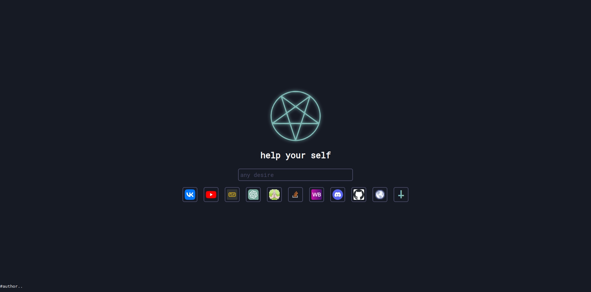

# lvplvce

 

 

Задача проекта - позволить обычному пользователю иметь возомжность _в будущем_ полной кастомизации стартовой страницы браузера **Google Chrome**.

### Задача проекта:

- Создать удобную среду для работы с базовыми задачами:
  - работой с закладками и микросервисами*
  - интуетивной схемой кастомизации
  - API*, для создания кастомного функционала  
- Продукт для обычных и продвинутых пользователей 
 

* звёздочкой помечен не реализованный функционал

## Установка (Installing): 

### Шаг 1: Скачайте расширение из архива
[**install**](https://github.com/s1ma82/lvplvce/releases)
Установите _zip_ архив из репозитория с расширением

### Шаг 2: Распакуйте архив в папку
### Шаг 3: Установите расширение

1 Для этого вам понадобится браузер работающий на движке "**Chromium**".  
2 Зайдите в настройки расширений и включите режим разработчика.

3 После этого установите распакованное расширение.

# Управление 
- Переключение между закладками: &#8592; и &#8594;
- Чтобы перейти на страницу: Ctrl + Enter
